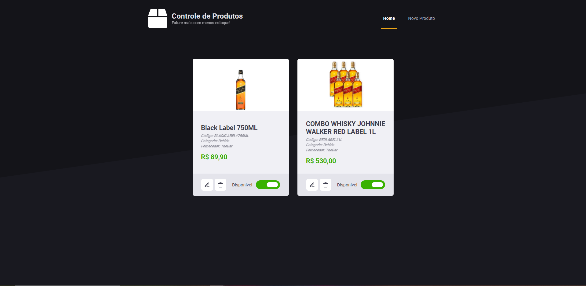

<h1 align="center">
    
</h1>

<br>

## 📦 Controle de Produtos

Controle de Produtos é uma aplicação, onde você consegue adicionar, remover ou editar, novos produtos para seu estoque virtual.
- Adicionar um novo produto ao estoque;
- Remover um produto do estoque;
- Editar um produto existente;
- Tornar um porduto indisponível;
- Validação se já existe algum produto com o mesmo código no estoque;	
- Exibição de mensagens de erro;
- Entre outros.

## 🛠 Tecnologias

Esse projeto foi desenvolvido com as seguintes tecnologias:

- ReactJS
- Typescript
- React-Router
- React-Modal
- Toastify
- Styled-components

## 🚀 Como executar

Clone o projeto e acesse a pasta do mesmo.

```bash
$ git clone git@github.com:desafiosjamestip/desafio-front-end.git

# Entre na pasta do projeto, e acessa a branch de desenvolvimento.
$ cd desafio-front-end
$ git checkout luizsmatos-desafio-front-end
```

Para iniciá-lo, siga os passos abaixo:
```bash
# Instalar as dependências
$ yarn

# Iniciar o projeto
$ yarn start
```

---
